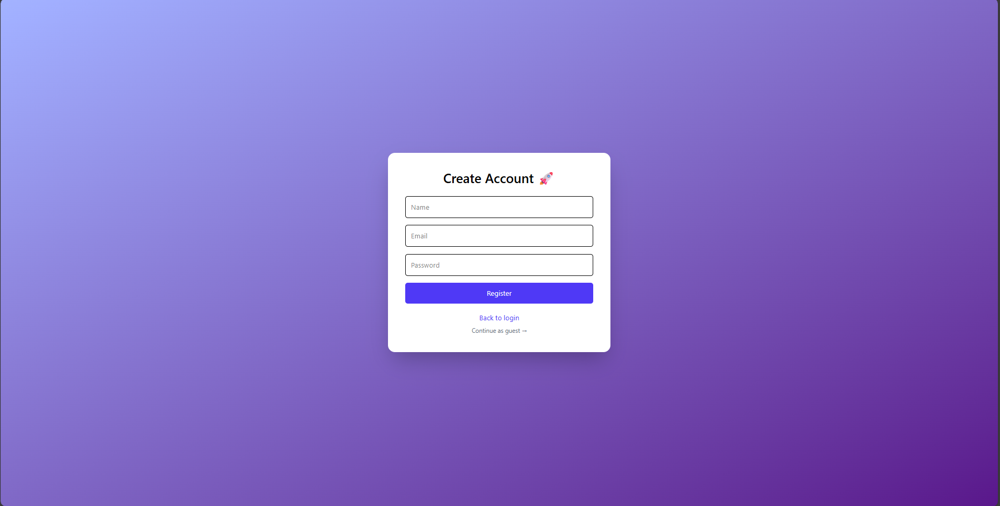
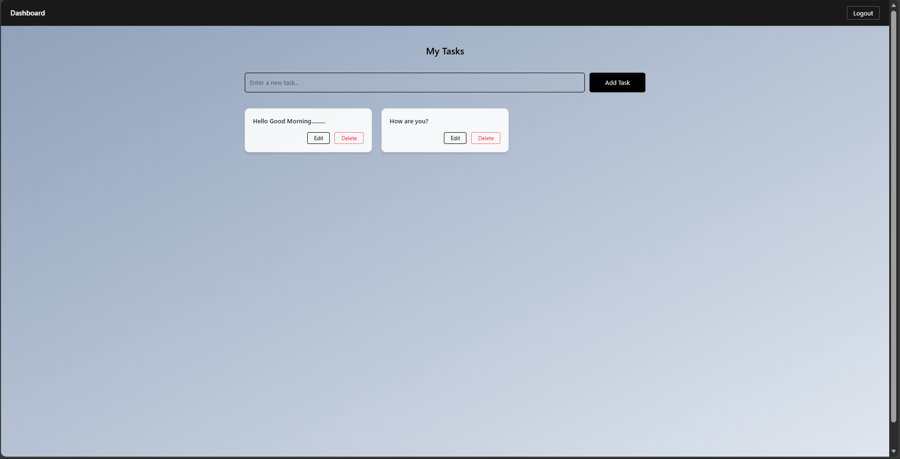

# 🚀 Full Stack MERN Dashboard Application

A modern full-stack dashboard application built with the MERN stack featuring JWT authentication, protected routes, responsive UI, and full CRUD operations.

This project demonstrates frontend engineering skills combined with backend integration, focusing on scalability, security, and clean architecture.

---

## ✨ Features

- User Registration & Login (JWT Authentication)
- Password Hashing using bcrypt
- Protected API routes
- Public dashboard with protected actions
- Create, Read, Update, Delete (CRUD) tasks
- Responsive UI using TailwindCSS
- Modern authentication UI
- Inline task editing
- Click-outside cancel edit
- Guest dashboard access
- Logout functionality

---

## 📸 Screenshots

### Login

### Register

### Dashboard

---

## 🛠 Tech Stack

Frontend:
- React (Vite)
- TailwindCSS
- Axios
- React Router

Backend:
- Node.js
- Express.js
- MongoDB
- Mongoose
- JWT
- bcryptjs

---

## 📁 Project Structure

fullstack-dashboard/
client/   (React frontend)  
server/   (Node + Express backend)

---

## ⚙️ Environment Variables

Create `.env` inside `/server`:

PORT=5000  
MONGO_URI=your_mongodb_connection_string  
JWT_SECRET=your_secret_key  

---

## ▶️ How To Run Locally

Backend:

cd server  
npm install  
npm run dev  

Server runs on:

http://localhost:5000

---

Frontend:

cd client  
npm install  
npm run dev  

Frontend runs on:

http://localhost:5173

---

## 🔐 Authentication Flow

1. User registers account  
2. Password is hashed and stored in MongoDB  
3. User logs in  
4. JWT token is issued  
5. Token is stored in localStorage  
6. Protected API routes verify JWT middleware  
7. Dashboard allows CRUD operations  

---

## 📌 API Endpoints

Auth:

POST /api/auth/register  
POST /api/auth/login  

Tasks:

GET /api/tasks  
POST /api/tasks  
PUT /api/tasks/:id  
DELETE /api/tasks/:id  

All task routes require Authorization header with JWT token.

---

## 🧠 Learning Outcomes

- JWT authentication  
- RESTful API design  
- Secure password handling  
- React state management  
- Component separation  
- Responsive UI with Tailwind  
- Clean project architecture  

---

## 🚀 Scalability & Production Considerations

For production deployment:

- Frontend hosted on Vercel  
- Backend deployed on Render or AWS  
- MongoDB Atlas for cloud database  
- Docker for containerization 
- Secure environment variables  
- CI/CD pipelines  

---

## Made with ❤️ by Chaitanya